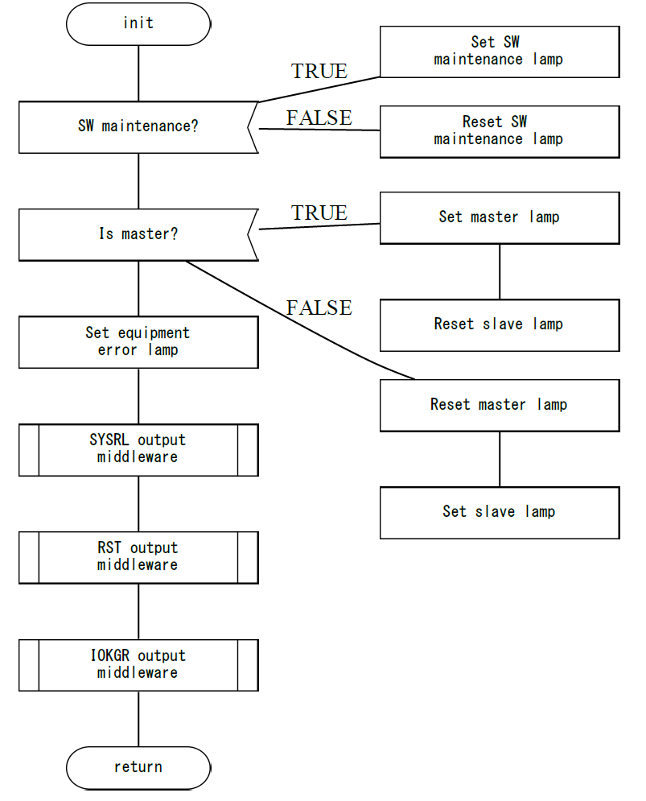

# python-flowChart

**version a1.1 (alpha 1.2)**

Python program for creating flowchart from source code. Program was developed with purpose to sync source code with documentation for work purpose.

This program uses reference comments inside source code to generate flow chart.

## How to use
### What do I need?
To use this python program, you will need the following SW packages:
- <a href="https://graphviz.org/">Graphviz</a> (I'm using Windows 10 for development and test)
 - Make sure you have it in environment variable. If you run from CMD or terminal, command `dot` should be callable.
 - If it isn't executed, add variable. For Windows, the path should be *\"C:\Program Files\Graphviz\bin\"* if you install in default directory.
- Python (I'm using <a href="https://www.anaconda.com/distribution/">Anaconda Python</a> 3.7 for development and test)
- Pthon packages:
  - <a href="https://graphviz.readthedocs.io/en/latest/index.html">graphviz</a>
  - <a href="https://pypi.org/project/jaconv/">jaconv</a> (if you use Japanese comments)

### How to use?
- Clone or download repository.
- Put reference comments in your source code (see chapter **Reference comments**)
- Use command line input

#### CLI support
```
usage: flowchart.py [-h] -s SOURCE -d DEST [-j] [-v] [--func FUNCS] -l LANG

optional arguments:
  -h, --help            show this help message and exit
  -s SOURCE             Absolute or relative path to source code file.
  -d DEST               Absolute or relative path to destination folder.
  -j, --jaconv          If set, jaconv (for Japanese) will be used.
  -v, --view            If set, preview will be enabled.
  --func FUNCS          With this argument you can create graph for only
                        specified functions in source code.
  -l LANG, --lang LANG  With this argument you define programming language you
                        are using. "C" is for C-like comments and "python" is
                        for python like comments
```

#### Example

The following line will export every function from testCode.c as separate PDF files in OutputFolder. We use path relative to *flowchart.py*.
`python flowchart.py -s src/testCode.c -d OutputFolder`

The following line will export only functions *foo1* and *foo2* from testCode.c as separate PDF files in OutputFolder. We use path relative to *flowchart.py*.
`python flowchart.py -s src/testCode.c -d OutputFolder --func foo1 --func foo2`

#### Warning
- Code was tested on embedded C source code.
- Program uses **graphviz** for generating flow chart diagram. 
- Currently program generates correct flow of data, but alignment is sometimes hard to read (will try to fix this).
- Currently program generates only PDF file. "Paper size" is as big as it needs to be (will try to fix this).

# Daido graph

*Daido graph* is one sort of flow chart diagrams. The company I worked for used this style of flow chart.

These are elements representing the diagram:
- Start and stop of function
  <br>
  
- Process
  <br>
  
- If branch
  <br>
  
- Ifdef macro branch
  <br>
  
- For loop (in the future any loop)
  <br>
  
- Sub function
  <br>
  
- Sub routine
  <br>
  
- Middleware
  <br>
  
- Interrupt routine
  <br>
  


# Reference comments

Reference comments are used to create flow chart diagram based on source code. To generate proper diagram, the following syntax of reference comment must be used.

`fc:<block_name> string_without_space "string with space"`

For `<block_name>` use one of the comments from **List of reference comments**.
<br>
After `<block_name>` you can place two strings. If string is separated with space, it will be moved to new line in diagram block. To avoid that, use **"** for strings with space.

### Examples:

`fc:<block_name> short string` will be displayed as

|short |
|------|
|string|

`fc:<block_name> "short string"` will be displayed as

|short string|
|------|
||

`fc:<block_name> string` will be displayed as

|string|
|------|
||

`fc:<block_name> "upper level" "lower level"` will be displayed as

|upper level |
|------------|
|lower level |

There is also a limit how many strings can go into 1 row. The limit is 24 half-width characters or 12 full-width characters. Actually, you can input more, but text will go out of borders.
<br>
>this is half-width
><br>
>ｔｈｉｓ　ｉｓ　ｆｕｌｌーｗｉｄｔｈ
><br>
>ﾊﾝｶｸ
><br>
>全角


## List of reference comments

Currently supported are the following comments:
- fc:startStop
- fc:process
- fc:ifBranch
- fc:ifMacro
- fc:else
- fc:forLoop
- fc:end
- fc:subFunc
- fc:subRoutine
- fc:interrupt
- fc:middleware

## How to use reference comments

### fc:startStop

This comment represents start and stop of the function.
<br>
File name will be taken by this comment. If you put space between words, newline will be show in diagram, but in file name space " " will be replaced by uderline "_".

```c
void func(){  //fc:startStop func
...
...
}  //fc:startStop return
```

### fc:process

This comment represents process line of code.

```c
int a = 5;  //fc:process "init var a" "with 5"

some_var = new_val;  //fc:process "append new_val" "to some_var"
```

### fc:ifBranch

This comment represents beginning of **if** sentence.

```c
if(a > 5){  //fc:ifBranch "is a > 5 ?"
  ...
}
```

### fc:else

This comment represents beginning of **else** part of **if** sentence.

```c
if(a > 5){  //fc:ifBranch "is a > 5 ?"
  ...
}
else{  //fc:else
  ...
}  //fc:end
```

### fc:ifMacro

This comment represents beginning of **#ifdef** or **#if** macro.

```c
#ifdef MY_MACRO1  //fc:ifMacro "MY_Macro1"
  ...
#else  //fc:else
  ...
#endif  //fc:end
}
```

### fc:forLoop

This comment represents beginning of **for** loop. It can be also used for other loops.
<br>
Name will change in the future to "loop".

```c
for(int i = 0; i < 10; i++){  //fc:forLoop "loop 10 times"
  ...
}  //fc:end
```

### fc:end

This comment represents end of **if** sentence and end of **for** loop. It can be also used for other loops.
<br>
Always place **fc:end** at the end of *loops* and *ifs*.

```c
for(int i = 0; i < 10; i++){  //fc:forLoop "loop 10 times"
  ...
}  //fc:end
```

### fc:subFunc

This comment represents call of a sub function. It is based on user's code and opinion to decide what is sub function.

```c
void func(){
  int a = 5;
  longCode();  //fc:subFunc long_code longCode()
  a = 3;
}
```

### fc:subRoutine

This comment represents call of a sub routine. It is based on user's code and opinion to decide what is sub routine.

```c
void func(){
  int a = 5;
  executeRepetitiveCode();  //fc:subFunc repetitive_code executeRepetitiveCode()
  a = 3;
}
```

### fc:middleware

This comment represents call of a middleware function. It is based on user's code and opinion to decide which function is middleware.

```c
void func(){
  int a = 5;
  a = myMiddleware();  //fc:subFunc middleware myMiddleware()
}
```

# Example

### Source code

```c
void init(void){  //fc:startStop init

  /* fc:ifBranch "SW maintenance?" */
  if((sysinput.sysin_fix & MAINT_SW) == MAINT_SW){
    /* fc:process "Set SW " "maintenance lamp" */
    sysoutput.sysout |= MAINTSW_LAMP;
  }else{  //fc:else
    /* fc:process "Reset SW " "maintenance lamp" */
    sysoutput.sysout &= (UW)(~MAINTSW_LAMP);
  }  //fc:end
  
  if(execution.unit == EXEC_MASTER){    /*fc:ifBranch "Is master?" */
    sysoutput.sysout |= MASTER_LAMP;    /*fc:process "Set master lamp" */
    sysoutput.sysout |= SLAVE_LAMP;     /*fc:process "Reset slave lamp" */
  }else{  //fc:else
    sysoutput.sysout &= (UW)(~MASTER_LAMP);    /*fc:process "Reset master lamp" */
    sysoutput.sysout &= (UW)(~SLAVE_LAMP);     /*fc:process "Set slave lamp" */
  }  //fc:end

  sysoutput.sysout |= EQPERR_LAMP;    /*fc:process "Set equipment" "error lamp" */
  
  /*fc:middleware "SYSRL output" middleware */
  mdl_sysrl_out(TSK_INIT, CID_74, (UH)sysoutput.sysout);
  
  /*fc:middleware	"RST output" middleware */
  mdl_rst_out((UH)sysoutput.trst_ctl, (UH)sysoutput.trst_ctl);
  
  /* fc:middleware "IOKGR output" middleware */
  mdl_iokgr_out(TSK_INIT, CID_73, (UH)sysoutput.iokgr_ctl);
} //fc:startStop return
```
### Generated flow chart


